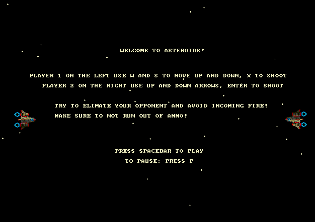
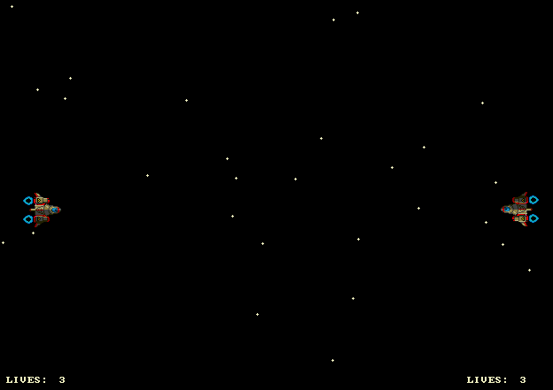
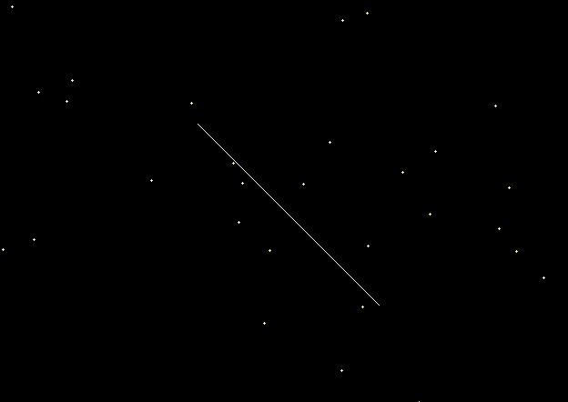
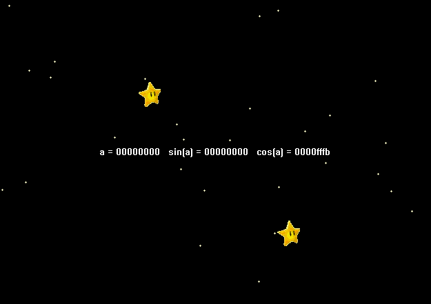

# Asteroids
Small asteroids-inspired game built in MASM32 assembly for x86 architecture

This is a 2 player game where each player controls a spaceship on opposite sides of the screen. Use W-S or Up-Down to move the spaceship, and use X and Enter to shoot, respectively. If you are hit by a bullet, don't worry as each player has 3 lives. But too many hits, and your spaceship goes down and the game is over!

## Prerequisites

The game requires a Windows machine, or can also be run on a virutal machine on MacOS. If not already installed, download MASM from `http://www.masm32.com/` and follow the instructions from the installer.

## Demo

### Game

Running the game will land you on the menu screen, and then after pressing space bar the game begins!

<p align="left">
  
  
</p>

### Stars

Sample code for running just the background of the game.

<p align="left">
  
</p>

### Lines

Sample code for a line generator.

<p align="left">
  
</p>

### Blit

Sample code to rotate the star using the left and right arrow keys.

<p align="left">
  
</p>

## Structure

The main game is located in the `game` folder. In addition to the game, the repository also has the `stars`, `lines`, and `blit` folders which can be used to explore how to implement different fundamentals used in the final game. 

Each of the folders can be built and run individually with the steps below (shown are the steps to build and run the whole `game`).

Navigating to the target directory:
```cmd
cd game
```

Building with the provided `make.bat`:
```cmd
make
```

Running the exe:
```cmd
game.exe
```

## License

